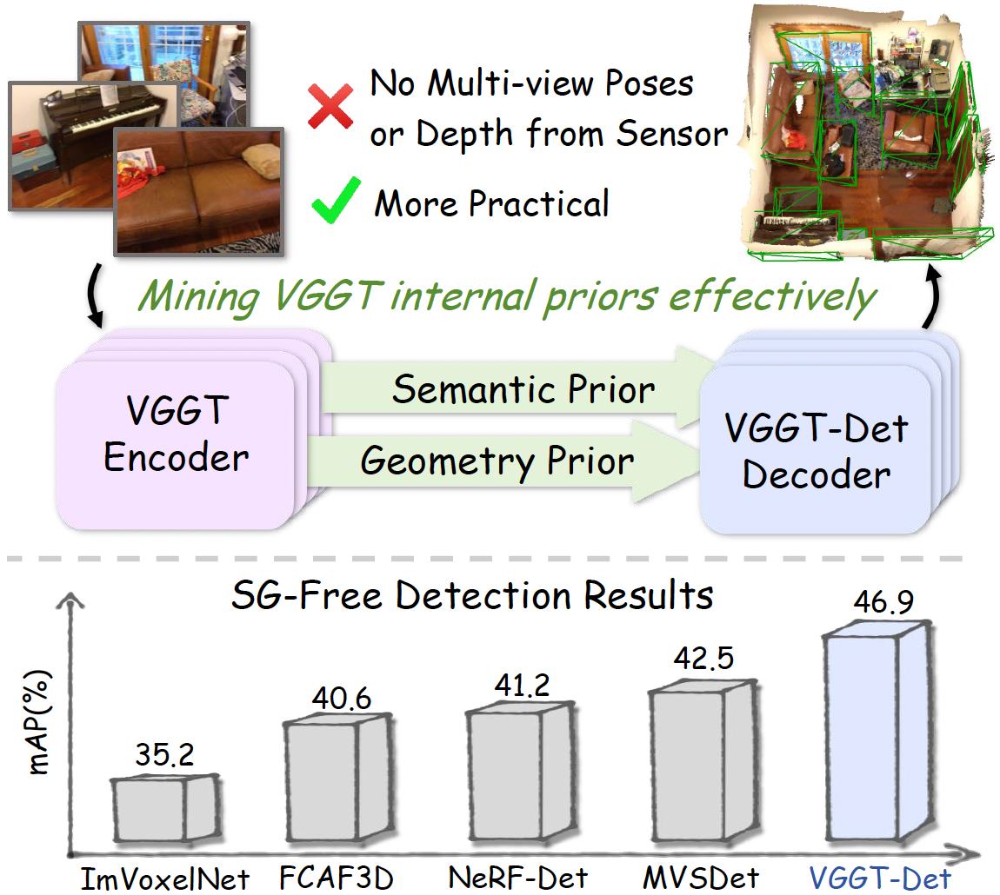
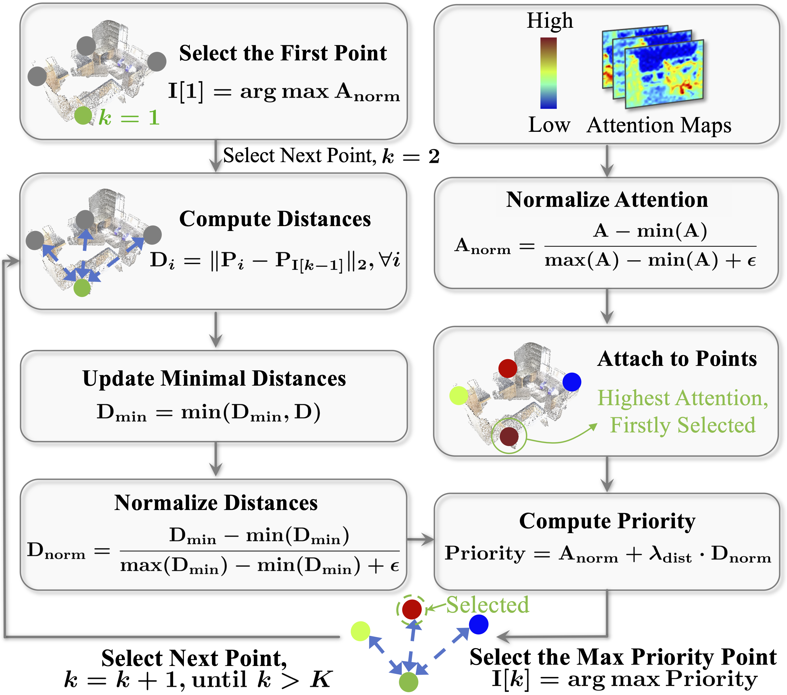

## :book: VGGT-Det: Mining VGGT Internal Priors for Sensor-Geometry-Free Multi-View Indoor 3D Object Detection (CVPR2026)
<p align="center">
  <small> 🔥Please star VGGT-Det ⭐ and share it. Thanks🔥 </small>
</p>

<!-- > [[Paper](https://arxiv.org/abs/xxx)] <br> -->
> [Yang Cao*](https://yangcaoai.github.io/), [Feize Wu*](https://feizewu.github.io/), [Dave Zhenyu Chen](https://daveredrum.github.io/), [Yingji Zhong](https://zhongyingji.github.io/), [Lanqing Hong](https://racheltechie.github.io/), [Dan Xu#](https://www.danxurgb.net) <br>
> The Hong Kong University of Science and Technology<br>
> Huawei 
> Sun Yat-Sen University

:triangular_flag_on_post: **Updates**  


&#9745; Our VGGT-Det is accepted by CVPR2026. The paper and codes will be released soon.

## Motivation
<!--  -->
<div align="center">  </div>

## Framework 


<!-- ## Computation flow of Attention-Guided Query Generation  -->
<!--  -->
<!-- <div align="center">  </div> -->

## Visualization of Attention-Guided Query Generation 
<div align="center">  </div>


## :scroll: BibTeX
If VGGT-Det is helpful, please cite:
```
@inproceedings{cao2026vggtdet,
  title={VGGT-Det: Mining VGGT Internal Priors for Sensor-Geometry-Free Multi-View Indoor 3D Object Detection},
  author={Cao, Yang and Wu, Feize and Dave Chen, Zhenyu and Zhong, Yingji and Hong, Lanqing and Xu, Dan},
  booktitle={CVPR},
  year={2026}
}
```

## :e-mail: Contact

If you have any question, please email `yangcao.cs@gmail.com`.

## :scroll: Sincere Acknowledgement

Appreciate the following works for their great contributions:

[VGGT](https://github.com/facebookresearch/vggt): Inspire our study for Sensor-Geometry-Free 3DDet.

[MVSDet](https://github.com/Pixie8888/MVSDet) and [NeRF-Det](https://github.com/facebookresearch/NeRF-Det): Serves as the
foundation for our codes.
